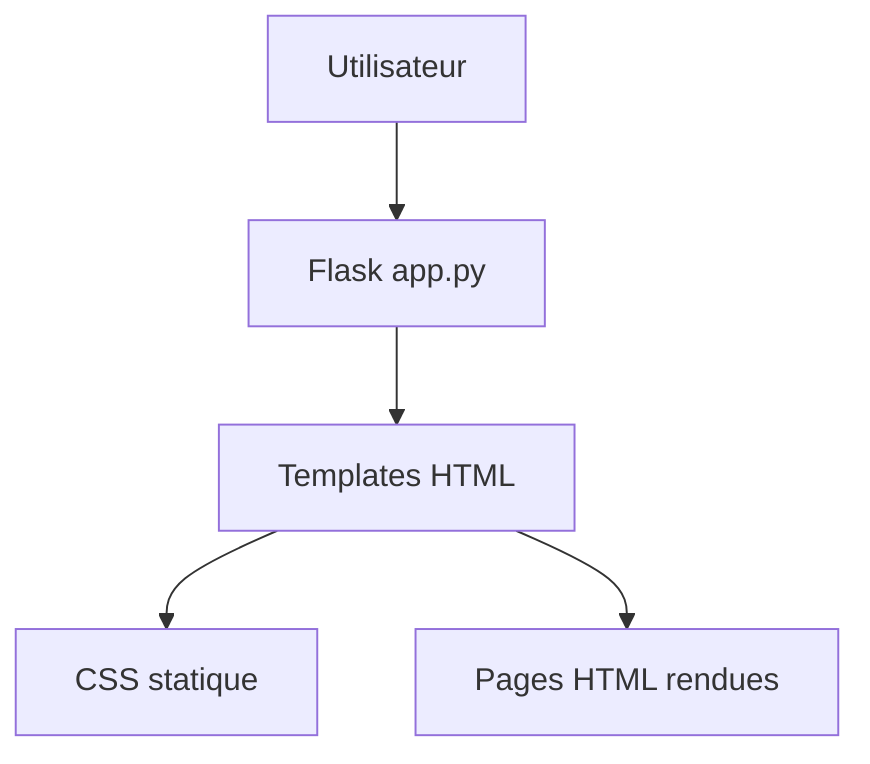
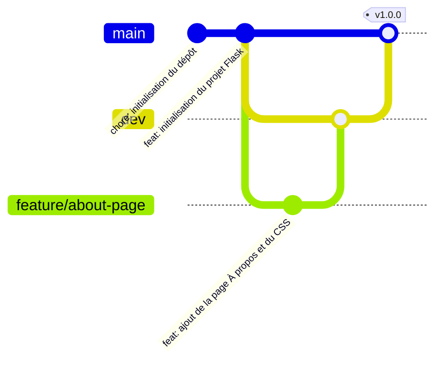
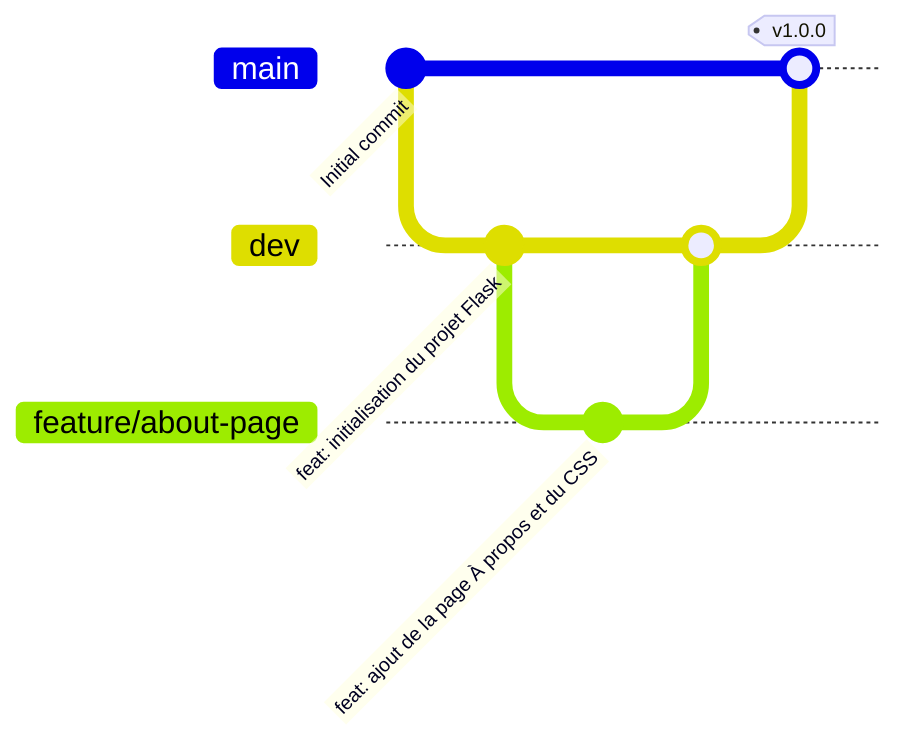

# Guide — Créer, versionner et développer un projet Flask avec Git et GitHub

### Technologies

[](https://www.python.org/)


### Informations sur le dépôt


[]()
[](https://github.com/boudjelaba/Git-Repo-Exp/node-chat)


Exemples de Badges GitHub spécifiques au repo disponibles :

[GitHub Badges Reference](https://docs.github.com/en/actions/monitoring-and-troubleshooting-workflows/adding-a-workflow-status-badge?utm_source=chatgpt.com)

---


> Projet d’exemple pour apprendre Flask, Git, GitHub, les branches `main` / `dev` / `feature/*` et une intégration continue simple.

---

## Table des matières

<!-- TOC START -->
- [Guide — Créer, versionner et développer un projet Flask avec Git et GitHub](#guide--créer-versionner-et-développer-un-projet-flask-avec-git-et-github)
    - [Technologies](#technologies)
    - [Informations sur le dépôt](#informations-sur-le-dépôt)
  - [Table des matières](#table-des-matières)
  - [Introduction](#introduction)
    - [Objectif](#objectif)
    - [Technologies](#technologies-1)
    - [Schéma d'architecture](#schéma-darchitecture)
  - [1. Préparation de l’environnement](#1-préparation-de-lenvironnement)
  - [2. Premier commit du projet](#2-premier-commit-du-projet)
    - [Fichier `.gitignore`](#fichier-gitignore)
    - [Fichier `README.md` et Initialisation Git](#fichier-readmemd-et-initialisation-git)
    - [Création du dépôt GitHub](#création-du-dépôt-github)
    - [Liaison avec GitHub](#liaison-avec-github)
  - [3. Création de l’application Flask](#3-création-de-lapplication-flask)
    - [Nouvelle structure du projet](#nouvelle-structure-du-projet)
    - [Fichier `app.py`](#fichier-apppy)
    - [Fichier `templates/index.html`](#fichier-templatesindexhtml)
    - [Test local du projet](#test-local-du-projet)
    - [Enregistrer le travail](#enregistrer-le-travail)
  - [4. Workflow de branches](#4-workflow-de-branches)
    - [Diagramme Git](#diagramme-git)
    - [Développement de la fonctionnalité](#développement-de-la-fonctionnalité)
    - [Arborescence après la fonctionnalité](#arborescence-après-la-fonctionnalité)
    - [`app.py`](#apppy)
    - [`templates/index.html`](#templatesindexhtml)
      - [`templates/about.html`](#templatesabouthtml)
      - [`static/style.css`](#staticstylecss)
    - [Tester localement](#tester-localement)
    - [Enregistrer les modifications](#enregistrer-les-modifications)
    - [Intégration dans `dev`](#intégration-dans-dev)
    - [Publication de la version stable](#publication-de-la-version-stable)
    - [Workflow de branches](#workflow-de-branches)
  - [5. Tests avec Pytest](#5-tests-avec-pytest)
    - [Installation](#installation)
    - [Fichier `tests/test_app.py`](#fichier-teststest_apppy)
    - [Exécution des tests](#exécution-des-tests)
  - [6. Intégration continue](#6-intégration-continue)
    - [Structure attendue](#structure-attendue)
    - [Fichier `.github/workflows/ci.yml`](#fichier-githubworkflowsciyml)
  - [7. Commandes Git utiles](#7-commandes-git-utiles)
    - [Flux de travail courant](#flux-de-travail-courant)
    - [Version stable](#version-stable)
  - [8. Version stable](#8-version-stable)
  - [Conclusion](#conclusion)
<!-- TOC END -->

---

## Introduction

### Objectif

Ce projet a pour objectif de démontrer :

- la création d'une application Flask simple ;
- la gestion d'un environnement Python ;
- l'utilisation de Git pour le versionnement ;
- l'utilisation de GitHub pour l'hébergement du code ;
- la mise en place d'un workflow basé sur les branches `main`, `dev` et `feature/*`

### Technologies

- Python 3.10+.
- Flask.
- Git.
- GitHub.
- GitHub Actions.
- Pytest.

### Schéma d'architecture

```text
Utilisateur
     │
     ▼
 Flask (app.py)
     │
     ▼
 Templates HTML
     │
     ▼
 CSS statique
```

Mermaid :



---

## 1. Préparation de l’environnement

Installer les outils nécessaires :

- Python 3.10 ou supérieur.
- Git.
- VS Code.
- Un compte GitHub.

Créer le dossier du projet

```bash
mkdir Git-Repo-Exp
cd Git-Repo-Exp
```

Créer et activer un environnement virtuel :

```bash
python -m venv venv
```

- Linux/macOS : `source venv/bin/activate`
- Windows : `venv\Scripts\activate`

Installer Flask puis générer `requirements.txt` :

```bash
# touch requirements.txt
pip install flask
pip freeze > requirements.txt
```

---

## 2. Premier commit du projet

Créer les fichiers de base du dépôt :

```text
Git-Repo-Exp/
├── .gitignore
├── LICENSE
├── README.md
└── requirements.txt
```

### Fichier `.gitignore`

```gitignore
venv/
.venv/

__pycache__/
*.py[cod]

.pytest_cache/
.coverage

.env

.vscode/
.idea/

.DS_Store
Thumbs.db
```

### Fichier `README.md` et Initialisation Git

Copier et coller le contenu de ce document dans le `README.md`.

Initialiser Git puis créer le premier commit :

```bash
git init

git add README.md .gitignore LICENSE requirements.txt
git commit -m "chore: initialisation du dépôt"
```

### Création du dépôt GitHub

1. Aller sur [github.com/new](https://github.com/new)
2. Créer un dépôt nommé `Git-Repo-Exp`
3. **Ne pas cocher** : *Add a README*, *.gitignore*, *License*

### Liaison avec GitHub

```bash
git branch -M main

git remote add origin https://github.com/mon-compte/Git-Repo-Exp.git
# Variante SSH :
# git remote add origin git@github.com:mon-compte/Git-Repo-Exp.git

git push -u origin main
```

---

## 3. Création de l’application Flask

### Nouvelle structure du projet

```text
Git-Repo-Exp/
├── .gitignore
├── app.py
├── LICENSE
├── README.md
├── requirements.txt
├── screenshots/
├── static/
└── templates/
    └── index.html
```

### Fichier `app.py`

```python
from flask import Flask, render_template

app = Flask(__name__)

@app.route("/")
def home():
    return render_template("index.html")

if __name__ == "__main__":
    app.run(debug=True)
```

### Fichier `templates/index.html`

```html
<!DOCTYPE html>
<html lang="fr">
<head>
    <meta charset="UTF-8">
    <title>Mon Projet Exemple</title>
</head>
<body>
    <h1>Page d'accueil du projet Flask</h1>
</body>
</html>
```

### Test local du projet

Lancer l’application :

```bash
python app.py
```

Puis ouvrir :

[http://127.0.0.1:5000](http://127.0.0.1:5000)

### Enregistrer le travail

```bash
git add .
git commit -m "feat: initialisation du projet Flask"
git push -u origin main
```

---

## 4. Workflow de branches

Après la publication de la première version sur `main`, créer une branche `dev` qui servira à centraliser les développements futurs :

```bash
git switch -c dev
# Publier la branche
git push -u origin dev
```

Créer ensuite une branche de fonctionnalité depuis `dev` :

```bash
git switch dev
git pull origin dev
git switch -c feature/about-page
```

### Diagramme Git



### Développement de la fonctionnalité

Ajouter la fonctionnalité « À propos » et le CSS (voir sections ci-dessous) :

* modifier `app.py` ;
* modifier `templates/index.html` ;
* ajouter `templates/about.html` ;
* ajouter `static/style.css`.

### Arborescence après la fonctionnalité

```text
Git-Repo-Exp/
├── .github/
│   ├── ISSUE_TEMPLATE/
│   ├── pull_request_template.md
│   └── workflows/
│       └── ci.yml
├── .gitignore
├── app.py
├── LICENSE
├── README.md
├── requirements.txt
├── screenshots/
│   ├── home.png
│   └── about.png
├── static
│   └── style.css
├── templates
│      ├── about.html
│      └── index.html
└── tests/
    └── test_app.py
```

### `app.py`

```python
from flask import Flask, render_template

app = Flask(__name__)

@app.route("/")
def home():
    return render_template("index.html")

@app.route("/about")
def about():
    return render_template("about.html")

if __name__ == "__main__":
    app.run(debug=True)
```

### `templates/index.html`

```html
<!DOCTYPE html>
<html lang="fr">
<head>
    <meta charset="UTF-8">
    <title>Accueil</title>

    <link rel="stylesheet"
          href="{{ url_for('static', filename='style.css') }}">
</head>
<body>

    <nav>
        <a href="/">Accueil</a>
        <a href="/about">À propos</a>
    </nav>

    <h1>Bienvenue — Page d'accueil du projet Flask</h1>

</body>
</html>
```

#### `templates/about.html`

```html
<!DOCTYPE html>
<html lang="fr">
<head>
    <meta charset="UTF-8">
    <title>À propos</title>

    <link rel="stylesheet"
          href="{{ url_for('static', filename='style.css') }}">
</head>
<body>

    <nav>
        <a href="/">Accueil</a>
        <a href="/about">À propos</a>
    </nav>

    <h1>À propos</h1>

    <p>
        Exemple d’application Flask avec Git et GitHub.
    </p>

</body>
</html>
```

#### `static/style.css`

```css
body {
    font-family: Arial, sans-serif;
    margin: 40px;
    background-color: #f4f4f4;
    color: #333;
}

h1 {
    color: #0066cc;
}

nav {
    margin-bottom: 20px;
}

nav a {
    margin-right: 15px;
    text-decoration: none;
    color: #0066cc;
    font-weight: bold;
}

nav a:hover {
    text-decoration: underline;
}
```

### Tester localement

```bash
python app.py
```

Vérifier :

* [http://127.0.0.1:5000/](http://127.0.0.1:5000/)
* [http://127.0.0.1:5000/about](http://127.0.0.1:5000/about)

### Enregistrer les modifications

```bash
git add .
git commit -m "feat: ajout de la page À propos et du CSS"
git push -u origin feature/about-page
```

### Intégration dans `dev`

Après validation de la fonctionnalité, ouvrir une Pull Request :

```text
feature/about-page
        │
        ▼
   Pull Request
        │
        ▼
       dev
```

Ou fusionner localement :

```bash
git switch dev
git merge feature/about-page
git push origin dev
```

### Publication de la version stable

Lorsque les développements présents sur `dev` sont validés :

```bash
git switch main
git pull origin main

git merge dev

git tag -a v1.0.0 -m "Version stable 1.0.0"

git push origin main
git push origin v1.0.0
```

Flux recommandé :

```text
feature/about-page
        │
        ▼
   Pull Request
        │
        ▼
       dev
        │
        ▼
   Pull Request
        │
        ▼
      main
```

### Workflow de branches

Organisation recommandée :

```text
main      → branche stable
dev       → branche d’intégration
feature/* → branches de fonctionnalité
```

Exemple de workflow :



---

## 5. Tests avec Pytest

Pytest permet de vérifier automatiquement le comportement de l’application sans lancer le navigateur à la main. Pour Flask, la méthode recommandée consiste à utiliser `app.test_client()` dans des tests isolés.

### Installation

```bash
pip install pytest
```

### Fichier `tests/test_app.py`

```python
import pytest
from app import app

@pytest.fixture()
def client():
    app.config["TESTING"] = True
    with app.test_client() as client:
        yield client

def test_home_page(client):
    response = client.get("/")
    assert response.status_code == 200
    assert "Page d'accueil" in response.get_data(as_text=True)

def test_about_page(client):
    response = client.get("/about")
    assert response.status_code == 200
    assert "À propos" in response.get_data(as_text=True)
```

### Exécution des tests

```bash
python -m pytest
python -m pytest -v
python -m pytest tests/
```

---

## 6. Intégration continue

Le workflow GitHub Actions doit :

- installer les dépendances ;
- vérifier la syntaxe ;
- exécuter les tests si présents.

GitHub Actions permet de filtrer les déclenchements par branches, notamment avec `push` et `pull_request`.

### Structure attendue

```text
.github/
└── workflows/
    └── ci.yml
```

### Fichier `.github/workflows/ci.yml`

```yaml
name: CI

on:
  push:
    branches: [main, dev, "feature/**"]
  pull_request:
    branches: [main, dev]

permissions: read-all

jobs:
  test:
    runs-on: ubuntu-latest

    steps:
      - name: Checkout repository
        uses: actions/checkout@v4

      - name: Set up Python
        uses: actions/setup-python@v5
        with:
          python-version: "3.10"

      - name: Install dependencies
        run: |
          python -m pip install --upgrade pip
          pip install -r requirements.txt
          pip install pytest

      - name: Check Python syntax
        run: python -m compileall app.py tests/

      - name: Run tests
        run: pytest -v
```

---

## 7. Commandes Git utiles

| Commande | Description |
|---|---|
| `git log --oneline --graph --all` | Historique visuel. |
| `git diff main..dev` | Différences entre branches. |
| `git branch` | Lister les branches locales. |
| `git branch -d feature/about-page` | Supprimer une branche locale. |
| `git push origin --delete feature/about-page` | Supprimer une branche distante. |

### Flux de travail courant

```bash
git switch dev
git pull origin dev
git switch -c feature/about-page

# développement

git add .
git commit -m "feat: ajout de la page À propos"
git push -u origin feature/about-page

# puis PR vers dev
```

### Version stable

```bash
git switch main
git pull origin main
git merge dev
git tag -a v1.0.0 -m "Version stable 1.0.0"
git push origin main
git push origin v1.0.0
```

```bash
git init
git status
git add .
git commit -m "feat: description courte"
git branch -M main
git remote add origin git@github.com:mon-compte/Git-Repo-Exp.git
git push -u origin main

git switch -c dev
git switch -c feature/about-page
git push -u origin feature/about-page

git switch dev
git pull origin dev
git merge feature/about-page
git push origin dev

git switch main
git pull origin main
git merge dev
git tag -a v1.0.0 -m "Version stable 1.0.0"
git push origin main
git push origin v1.0.0
```

---

## 8. Version stable

Les tags comme `v1.0.0` marquent les versions stables sur `main`.

Exemple :

```bash
git tag -a v1.0.0 -m "Version stable 1.0.0"
git push origin v1.0.0
```

---

## Conclusion

À ce stade, on dispose d'une application Flask simple, versionnée avec Git, hébergée sur GitHub et intégrée à une chaîne CI GitHub Actions. Cette structure constitue une excellente base pour apprendre le développement collaboratif et faire évoluer le projet avec de nouvelles fonctionnalités.

---
